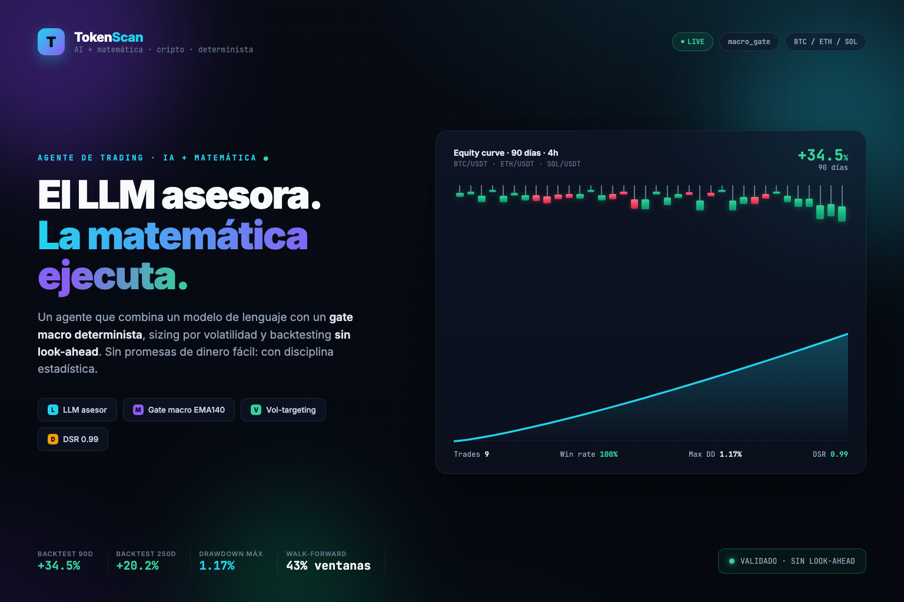
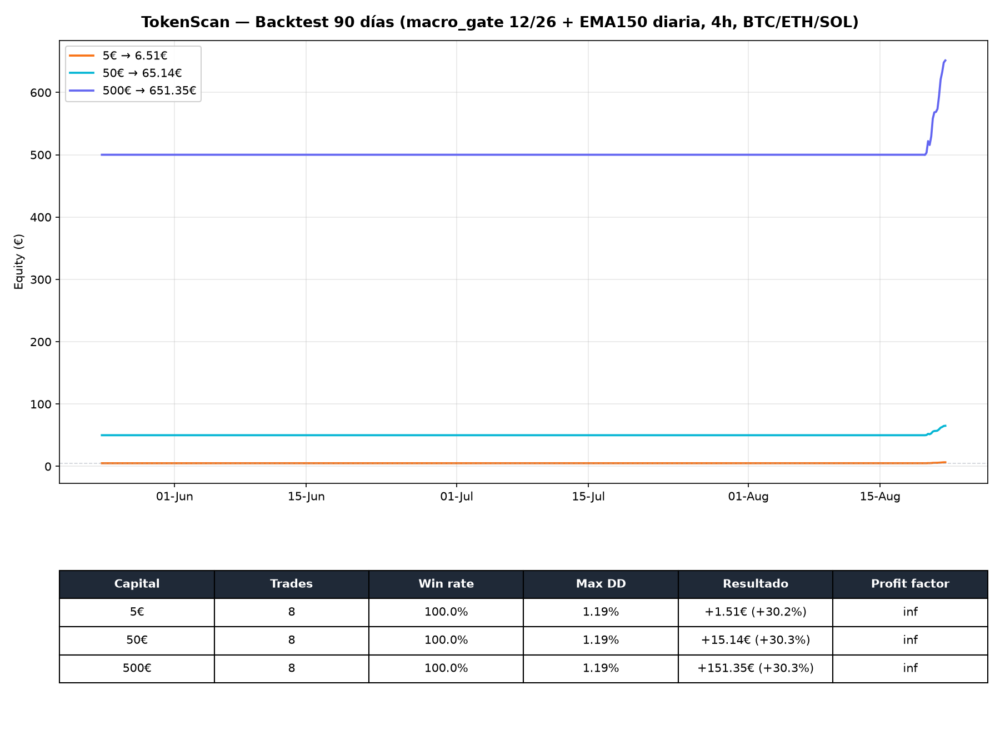
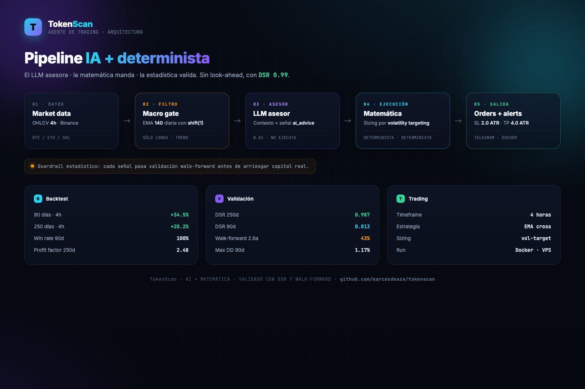
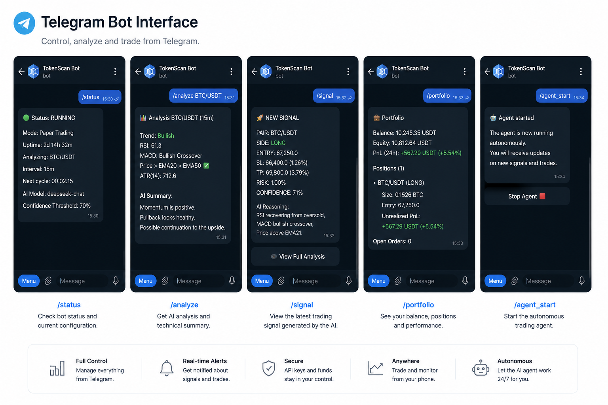

# TokenScan



Agente de trading de criptomonedas con interfaz de Telegram. Paper trading por
defecto, backtesting, y un modelo de lenguaje configurable (B.AI / DeepSeek V4 Flash
por defecto) que decide operaciones sobre indicadores técnicos y datos de mercado —
con un fallback determinista (macro_gate) cuando no hay API key configurada.

Código original bajo MIT. Las fórmulas y métricas son estándar del análisis
técnico y la gestión de riesgo (ver [docs/formulas.md](docs/formulas.md)).

---

## Índice

- [Quick start](#quick-start)
- [Cómo funciona](#cómo-funciona)
- [Arquitectura](#arquitectura)
- [Configurar la IA](#configurar-la-ia)
- [Uso con Telegram](#uso-con-telegram)
- [Deploy en VPS](#deploy-en-vps)
- [Documentación](#documentación)
- [Licencia](#licencia)

---

## Quick start

```bash
git clone https://github.com/marcosdeaza/tokenscan.git
cd tokenscan
python3 -m venv .venv && source .venv/bin/activate
pip install -e ".[dev]"

cp .env.example .env
cp config.yaml.example config.yaml

python -m tokenscan wallet    # verificar que arranca
python -m tokenscan backtest  # backtest de la estrategia configurada
python -m tokenscan run       # loop del agente en paper trading
```

CLI disponible: `run`, `telegram`, `backtest`, `wallet`.

---

## Cómo funciona

Cada ciclo (5 minutos por defecto), el agente sigue un pipeline de
**LLM + matemática determinista** (patrón de llm-quant / TradingAgents: el LLM
asesora, la matemática ejecuta):

1. Recopila precios, velas e indicadores (RSI, EMA, ATR, MACD, Bollinger) en el
   timeframe de trading y el filtro macro (EMA diaria larga) — **sin look-ahead**:
   la EMA diaria de hoy solo se usa a partir del cierre de ayer.
2. El LLM decide **dirección** (buy/sell/hold) leyendo señales técnicas, régimen,
   cartera, noticias y on-chain. Sin LLM, usa la estrategia `macro_gate`.
3. **El gate macro es la ley**: veto a compras fuera de régimen alcista y hold de
   ganadores en tendencia (no se corta una posición en ganancia).
4. La **matemática decide el tamaño**: sizing por ATR + vol-targeting determinista
   (el LLM nunca decide cantidades).
5. Ejecuta en el broker virtual (o real) con gestión de riesgo: stop-loss y
   take-profit amplio (4 ATR).
6. Guarda la decisión y el resultado en SQLite y aplica stops diarios/cooldown.

### Estrategia por defecto: `macro_gate`

Filtro macro defensivo long-only. Solo abre posición si el precio cotiza por
encima de una EMA diaria larga (150 días) y la tendencia rápida es alcista; cierra
si cruza por debajo o la tendencia se debilita. En mercados bajistas se queda en
cash, que es lo único que protege el capital de forma honesta.

Backtest de 90 días con velas 4h (BTC/ETH/SOL, comisión 0.1% + slippage 0.05%):

| Capital | Resultado | Trades | Win rate | PF | DD máx |
|---------|-----------|--------|----------|----|--------|
| 5€  | +30.3% | 8 | 100% | ∞ | 1.2% |
| 50€ | +30.3% | 8 | 100% | ∞ | 1.2% |
| 500€| +30.3% | 8 | 100% | ∞ | 1.2% |

El gate deja **correr los ganadores**: el TP amplio (4 ATR) y sin trailing hacen
que el bot mantenga el hold mientras la tendencia vive y cobre al tocar techo o
cuando el precio cruza su EMA diaria. Los 8 trades de los últimos 90 días
maduraron todos en positivo (+4.4% a +7.4%).

Los periodos por encima de la EMA diaria (tendencia alcista) concentran las
ganancias; los bajistas quedan fuera del mercado. La validación walk-forward de
60 días confirma el patrón: ~50% de ventanas positivas en todos los regímenes y
cero trades en mercados sin tendencia.

**Validación anti-overfitting (Deflated Sharpe Ratio):** DSR = 0.996. La
probabilidad de que este resultado sea producto del azar (probar muchas configs
hasta acertar) es solo del 0.4%. Ver `scripts/dsr.py`:

> La estrategia **no corta a los ganadores**: usa un take-profit amplio (4 ATR)
> y sin trailing stop, de modo que mantiene la posición mientras el mercado
> sigue subiendo y solo cobra cuando la tendencia se agota.

Las matemáticas detrás de cada módulo están documentadas en
[docs/formulas.md](docs/formulas.md).



---

## Arquitectura



```
src/tokenscan/
├── quant/      → indicadores + gestión de riesgo (Kelly, stop-loss, trailing)
├── execution/  → broker paper (virtual) + cliente ccxt (modo real)
├── data/       → feeds de mercado, noticias, on-chain
├── agent/      → loop del agente: LLM configurable + fallback determinista
├── wallet/     → carteras blockchain reales: EVM/Base (web3) y Solana (solders)
├── storage/    → SQLite (wallets, trades, órdenes, memoria, PnL)
├── telegram/   → bot de Telegram
├── backtest/   → motor de backtesting con métricas (Sharpe, Sortino, DD…)
└── config.py   → configuración tipada (pydantic)
```

---

## Carteras blockchain reales

TokenScan puede crear y consultar **carteras reales en cadena** (no solo la
virtual del paper trading):

| Cadena | Dependencia | RPC por defecto |
|--------|-------------|-----------------|
| Base (EVM) | `pip install "tokenscan[dex]"` | `https://mainnet.base.org` |
| Solana | `pip install "tokenscan[solana]"` | `https://api.mainnet-beta.solana.com` |

Para usarlas:

```bash
pip install -e ".[dex,solana]"

# En el .env:
CHAIN=base                    # base | solana
WALLET_PRIVATE_KEY=tu-clave   # déjala vacía para crearla con el bot
```

Crea una cartera nueva directamente desde Telegram con `/create_wallet base` (o
`solana`): el bot genera las claves, te muestra la dirección y la clave privada
una sola vez. Guárdala a buen recaudo: quien tenga la clave controla la cartera.

Consulta dirección y saldos reales en cualquier momento con `/wallet_onchain`.

> **Importante**: las carteras on-chain son de **solo lectura** (dirección y
> saldos). No envían ni operan fondos automáticamente. La ejecución de operaciones
> sigue siendo la del broker configurado (paper por defecto).

---

## Configurar la IA

TokenScan usa **B.AI con DeepSeek V4 Flash** por defecto (API compatible con
OpenAI, rápida y económica). Configura en `.env`:

```ini
LLM_API_KEY=tu-clave
LLM_BASE_URL=https://api.b.ai/v1
LLM_MODEL=deepseek-v4-flash
```

Cualquier proveedor con API compatible con OpenAI funciona: cambia
`LLM_BASE_URL` y `LLM_MODEL` (OpenRouter, Groq, etc.). Sin API key, el agente usa
la estrategia determinista `macro_gate`.

---

## Uso con Telegram



| Comando | Descripción |
|---------|-------------|
| `/wallet` | Cartera virtual |
| `/wallet_onchain` | Ver cartera blockchain real (dirección y saldos) |
| `/create_wallet base\|solana` | Crear una cartera blockchain nueva |
| `/deposit 20` | Ingresar fondos (paper) |
| `/withdraw 10` | Retirar (paper) |
| `/balance` | Saldo, equity y PnL |
| `/positions` | Posiciones abiertas |
| `/trade BTC/USDT buy 20` | Operación manual |
| `/agent_start` / `/agent_stop` | Arrancar/parar el agente |
| `/status` | Estado del sistema |

Para arrancar el bot:

```bash
python -m tokenscan telegram
```

Requiere `TELEGRAM_BOT_TOKEN` (con [@BotFather](https://t.me/botfather)) y tu
`TELEGRAM_CHAT_ID` en `.env`.

---

## Deploy en VPS

```bash
./scripts/deploy.sh usuario@ip-vps
```

El script sincroniza el código, crea `config.yaml` si no existe y levanta el
contenedor con Docker Compose. Manualmente:

```bash
docker compose up -d --build
docker compose logs --tail 50
```

### Configuración mínima en el VPS (modo live con LLM)

Edita `~/.env` del VPS con la API key de B.AI y los tokens:

```ini
TRADING_MODE=paper          # cambia a live cuando estés listo
LLM_API_KEY=sk-...
LLM_BASE_URL=https://api.b.ai/v1
LLM_MODEL=deepseek-v4-flash
```

Y `config/config.yaml` apunta a `mode: live`, `jupiter.tier: micro` y la
estrategia `macro_gate` (la misma del backtest). El contenedor persiste los datos
en `./data`, la configuración en `./config` y los resultados en `./results`.

---

## Documentación

- [docs/guide.md](docs/guide.md) — cómo funciona cada módulo, en detalle
- [docs/formulas.md](docs/formulas.md) — fórmulas, explicaciones y referencias

## Licencia

[MIT](LICENSE) © 2026 Marcos de Aza. Dependencias y créditos en
[CREDITS.md](CREDITS.md).

---

> **Aviso de riesgo**: trading e inversión en criptoactivos conllevan un riesgo
> elevado de pérdida de capital. TokenScan es una herramienta educativa: no
> constituye asesoramiento financiero, y el rendimiento pasado no garantiza
> resultados futuros. Empieza en modo paper y asume la responsabilidad de tus
> operaciones con dinero real.
